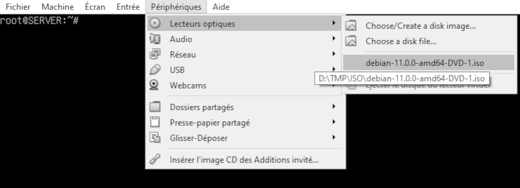
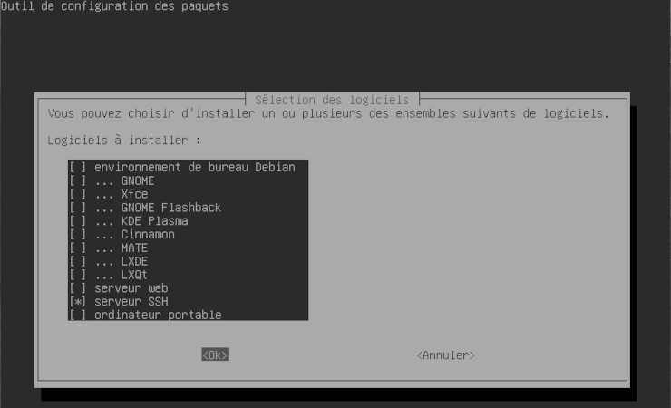
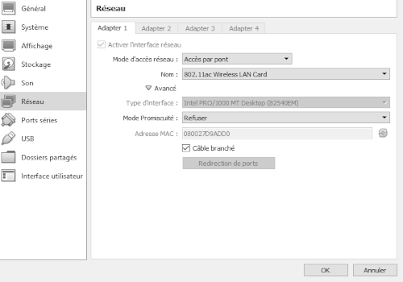

#   DEBIAN-SECURITY
  
___

### Fail2Ban & Network-Manager
`su -`  
  
***Insérez l'ISO de Debian***  
`apt-get install -y fail2ban network-manager`  

### NFTABLES
`nano /etc/nftables.conf`

    flush ruleset

    table inet my_table {
        set LANv4 {
            type ipv4_addr
            flags interval

            elements = { 10.0.0.0/8, 172.16.0.0/12, 192.168.0.0/16, 169.254.0.0/16 }
        }
        set LANv6 {
            type ipv6_addr
            flags interval

            elements = { fd00::/8, fe80::/10 }
        }

        chain my_input_lan {
            meta l4proto { tcp, udp } th dport 2049 accept comment "Accept NFS"

            udp dport netbios-ns accept comment "Accept NetBIOS Name Service (nmbd)"
            udp dport netbios-dgm accept comment "Accept NetBIOS Datagram Service (nmbd)"
            tcp dport netbios-ssn accept comment "Accept NetBIOS Session Service (smbd)"
            tcp dport microsoft-ds accept comment "Accept Microsoft Directory Service (smbd)"

            udp sport { bootpc, 4011 } udp dport { bootps, 4011 } accept comment "Accept PXE"
            udp dport tftp accept comment "Accept TFTP"
        }

        chain my_input {
            type filter hook input priority filter; policy drop;

            iif lo accept comment "Accept any localhost traffic"
            ct state invalid drop comment "Drop invalid connections"
            ct state established,related accept comment "Accept traffic originated from us"

            meta l4proto ipv6-icmp icmpv6 type { destination-unreachable, packet-too-big, time-exceeded, parameter-problem, mld-listener-query, mld-listener-report, mld-listener-reduction, nd-router-solicit, nd-router-advert, nd-neighbor-solicit, nd-neighbor-advert, ind-neighbor-solicit, ind-neighbor-advert, mld2-listener-report } accept comment "Accept ICMPv6"
            meta l4proto icmp icmp type { destination-unreachable, router-solicitation, router-advertisement, time-exceeded, parameter-problem } accept comment "Accept ICMP"
            ip protocol igmp accept comment "Accept IGMP"

            udp dport mdns ip6 daddr ff02::fb accept comment "Accept mDNS"
            udp dport mdns ip daddr 224.0.0.251 accept comment "Accept mDNS"

            ip6 saddr @LANv6 jump my_input_lan comment "Connections from private IP address ranges"
            ip saddr @LANv4 jump my_input_lan comment "Connections from private IP address ranges"

            tcp dport ssh accept comment "Accept SSH on port 22"

            tcp dport ipp accept comment "Accept IPP/IPPS on port 631"

            tcp dport { http, https, 8000, 8001, 8008, 8080, 1880 } accept comment "Accept HTTP (ports 80, 443, 8000, 8001, 8008, 8080, 1880)"

            udp sport bootpc udp dport bootps ip saddr 0.0.0.0 ip daddr 255.255.255.255 accept comment "Accept DHCPDISCOVER (for DHCP-Proxy)"
        }

        chain my_forward {
            type filter hook forward priority filter; policy drop;
            # Drop everything forwarded to us. We do not forward. That is routers job.
        }

        chain my_output {
            type filter hook output priority filter; policy accept;
            # Accept every outbound connection
        }

    }

`systemctrl enable nftables.service`  
`systemctrl start nftables.service`  
`systemctrl status nftables.service`  
`nft list ruleset`
___

### Sudo
***ATTENTION À BIEN REMPLACER USERNAME IP-ADDRESS & PORT***❗❗❗  
`nano /etc/sudoers`  

    USERNAME ALL=(ALL:ALL) ALL

***On demande le mot de passe***  
🛑***OU INVERSEMENT***❗❗

    USERNAME ALL=(ALL) NOPASSWD: ALL

`exit`  
`sudo touch toto.txt`  
`sudo rm toto.txt`  
***Voilà... ...USERNAME possède les droits...***
__

### SSHD
`sudo tasksel`  
  
`sudo nano /etc/ssh/sshd_config`

    Port PORT
    ChallengeResponseAuthentication no
    UsePAM yes
    X11Forwarding yes
    PrintMotd yes
    AcceptEnv LANG LC_*
    Subsystem       sftp    /usr/lib/openssh/sftp-server
    PermitRootLogin no
    AllowUsers USERNAME
***Préférez le port 22 car nftables bloque...***
___

### APT
`nano /etc/apt/sources.list`  

***Commentez ou supprimez la ligne du CDROM Debian***  

    # deb cdrom:[...]
	deb http://deb.debian.org/debian/ bullseye main
	deb-src http://deb.debian.org/debian/ bullseye main
	deb http://security.debian.org/debian-security bullseye-security main contrib
	deb-src http://security.debian.org/debian-security bullseye-security main contrib
	deb http://deb.debian.org/debian/ bullseye-updates main contrib
	deb-src http://deb.debian.org/debian/ bullseye-updates main contrib
___

***On peut apparement rebrancher le câble....***  
  
`eject`  
`reboot`  
`sudo systemctrl status fail2ban.service`  
`sudo systemctrl status nftables.service`    
`ip a`    
___

***On peut maintenant finir la config de SSH***
### Connection SSH
`mkdir .ssh`  
***Depuis la machine hôte***  
`ssh-keygen`  

!!! UNIX!!!  
`ssh-copy-id -pPORT <USERNAME>@<IP-ADDRESS>`  
!!! OU POWERSHELL !!! (utile pour autolog awec l'application Terminal de Windows 10)  
`scp.exe -PPORT .\.ssh\id_rsa.pub USERNAME@IP-ADDRESS:~/.ssh/authorized_keys`  
  
`ssh -pPORT <USERNAME>@<IP-ADDRESS>`  

***Retour sous Debian***  
`sudo nano /etc/ssh/sshd_config`  

    PasswordAuthentication no
    UsePAM no
`sudo systemctrl restart sshd`  
___

### UoDate!
`nano ~/.upDate`

    printf "\nBonjour! Nous somme le :\n"
    date
    uptime -p

    apt-get update -y
    apt-get dist-upgrade -y
    apt-get autoclean -y
    printf "\nUpdate! :)\n"

    exit 0
`chmod 100 .upDate`  
`sudo ~/.update`  
`sudo shutdown -h 0`
___

###	Pensez à exporter!
