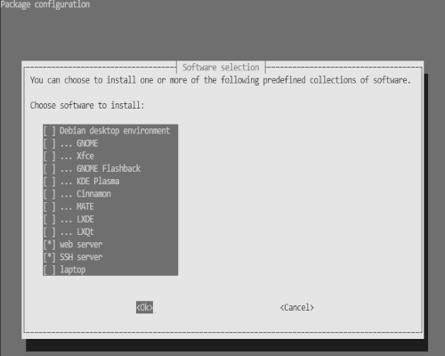

#   DEBIAN-WEB
  
___

###  Tools
`sudo apt-get install -y htop emacs-nox curl git`  
___

### Git
    git config --global user.name "USERNAME"
    git config --global user.email "EMAIL"
    git config --global color.ui auto
`ssh-keygen -t ed25519 -C "your_email@example.com"`  
`eval "$(ssh-agent -s)"`  
`ssh-add ~/.ssh/id_ed25519`   
`ssh -T git@github.com`  
***Et Collez le contenu sur GitHub.com... (.pub)***
___

###  NodeJS
`sudo curl -fsSL https://deb.nodesource.com/setup_18.x | sudo bash - `  
___

### Server Web
`sudo tasksel`  
  

`sudo apt-get -y install nodejs libapache2-mod-php7.4 mariadb-server mariadb-client librabbitmq-dev composer php7.4 php7.4-{apcu,amqp,bcmath,bz2,common,cli,curl,dev,fpm,gd,intl,mbstring,mysql,opcache,readline,redis,xdebug,xml,yaml,zip}`  
___

###  PHP 7.4
`sudo a2enmod proxy_fcgi setenvif`  
`sudo systemctl restart apache2`  
`sudo a2enconf php7.4-fpm`  
`sudo systemctl reload apache2`  
`sudo emacs -nw /etc/php/7.4/apache2/php.ini`

    memory_limit = 512M
    display_errors = On
    post_max_size = 32M
    upload_max_filesize = 64M
`sudo systemctl restart apache2`  
___

###  Apache 2
`sudo emacs -nw /etc/apache2/sites-available/000-Adminer.conf`

    Listen 8001
    <VirtualHost *:8001> 
        ServerAdmin USERNAME@localhost
        ServerName Adminer
        DocumentRoot /var/www/Adminer/public/
        <Directory /var/www/Adminer/public/>
            Options +Indexes +FollowSymLinks
            AllowOverride All
            Require all granted
        </Directory>
    </VirtualHost> 

`mkdir -p ~/Documents/Adminer/public`  
`sudo ln -s ~/Documents/Adminer /var/www/Adminer`  
`sudo a2ensite 000-Adminer.conf`  
`sudo systemctl reload apache2`  
`sudo a2enmod rewrite`  
`sudo systemctl restart apache2`  
___

###  Adminer
`cd ~/Documents/Adminer/public`  
`wget https://www.adminer.org/latest.php`  
`mv latest.php index.php`
___

### Mariadb
`sudo mysql -u root -p -h localhost`

    CREATE DATABASE projettest_db;
    GRANT ALL ON projettest_db .* TO 'YOUR_NICKNAME'@'localhost' identified by 'TEST1234' WITH GRANT OPTION;
    GRANT CREATE ON *.* to 'YOUR_NICKNAME'@'localhost';
    FLUSH PRIVILEGES;
    exit
`sudo systemctl restart mariadb.service`
___

###  NodeRED
`bash <(curl -sL https://raw.githubusercontent.com/node-red/linux-installers/master/deb/update-nodejs-and-nodered)`  
`sudo systemctl start nodered.service`  
`sudo systemctl enable nodered.service`
___

### Yarn
`curl -sL https://dl.yarnpkg.com/debian/pubkey.gpg | gpg --dearmor | sudo tee /usr/share/keyrings/yarnkey.gpg >/dev/null`
`echo "deb [signed-by=/usr/share/keyrings/yarnkey.gpg] https://dl.yarnpkg.com/debian stable main" | sudo tee /etc/apt/sources.list.d/yarn.list`
`sudo apt-get update && sudo apt-get install yarn`
___

### Symfony
`wget https://get.symfony.com/cli/installer -O - | bash`  
`symfony check:requirements`
___

##  Docker
### Engine
`sudo apt-get install apt-transport-https ca-certificates gnupg lsb-release`  
`curl -fsSL https://download.docker.com/linux/debian/gpg | sudo gpg --dearmor -o /usr/share/keyrings/docker-archive-keyring.gpg`  
`echo "deb [arch=amd64 signed-by=/usr/share/keyrings/docker-archive-keyring.gpg] https://download.docker.com/linux/debian $(lsb_release -cs) stable" | sudo tee /etc/apt/sources.list.d/docker.list > /dev/null`  
`sudo apt-get update`  
`sudo apt-get install docker-ce docker-ce-cli containerd.io`
___

### Compose
`sudo curl -L "https://github.com/docker/compose/releases/download/1.29.2/docker-compose-$(uname -s)-$(uname -m)" -o /usr/local/bin/docker-compose`  
`sudo chmod +x /usr/local/bin/docker-compose`  
___

### Command-line completion
`sudo curl -L https://raw.githubusercontent.com/docker/compose/1.29.2/contrib/completion/bash/docker-compose -o /etc/bash_completion.d/docker-compose`
___

### Add groupe 'Docker'
`sudo usermod -aG docker $USER`  
`newgrp docker`
___

###	Pensez à exporter!
`sudo shutdown -h 0`  

___

###  TOR
`sudo apt-get install -y tor`  
`sudo systemctl status tor@default.service`  
`sudo emacs -nw /etc/tor/torrc`

    SocksPort ADRESSE_IP_SERVER:PORT
    SocksPolicy accept 192.168.0.0/16
    RunAsDaemon 1
    DataDirectory /var/lib/tor

`sudo systemctl restart tor@default.service`  
***Pensez à update /etc/nftables.conf***  

  
***Paramètre dans Firefox de l'Host -> Paramètre réseau (tout en bas)***
___
###	Pensez à exporter!
